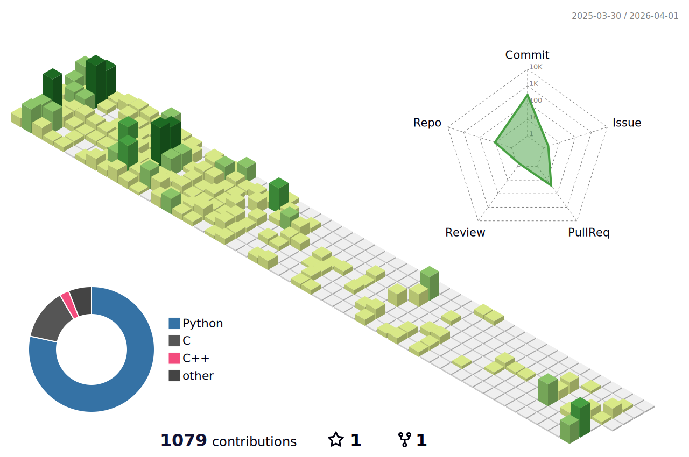

<h3 align="center">An Undergrad Programmer and DL Enthusiast</h3>

- 🌱 I’m currently learning about **DL, OS-Dev and how the Universe works.**

#### Connect with Me

-----------------

### About Me
- ⚙️ **Building a custom OS and shell from scratch** to remove bloatware and optimize performance.
- 🎯 Working on learning **Retrieval-Augmented Generation (RAG)**
- 🔬 Exploring **Blockchain**.
- 🧠 Passionate about **DL, IoT**, and cutting-edge tech innovations.

-----------------

<h3 align="left">Have a cool joke :</h3>

<!-- Add your social media links here -->

-----------------

<h3 align="left">Languages and Tools:</h3>

    
    
    
    
    
    
    
    
    
    

-----------------

----------------

