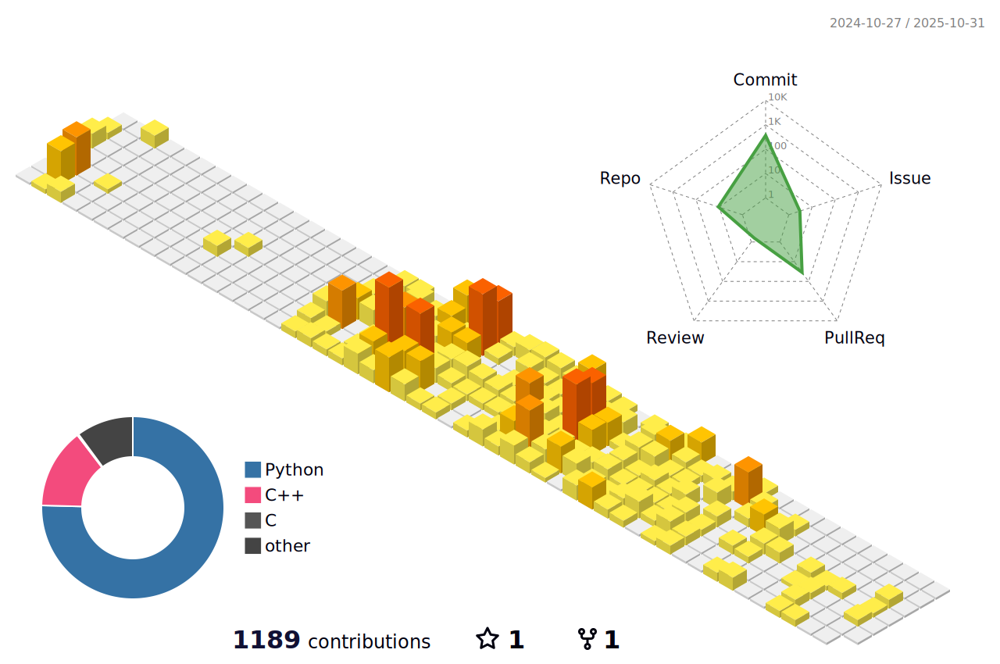

- 🌱 I’m currently learning about **DL, OS-Dev and how the Universe works.**

#### Connect with Me

-----------------

### About Me
- ⚙️ Currently experimenting with **RAG pipelines, custom embeddings**, and **vector DBs**.
- 🎯 Working on learning **Retrieval-Augmented Generation (RAG)**
- 🔬 Exploring **Blockchain**.
- 🧠 Passionate about **DL, IoT**, and cutting-edge tech innovations.

-----------------

<h3 align="left">Languages and Tools:</h3>

  
  
  
  
  
  
  
  
  
  
  
  
  
  
  
  

-----------------

----------------

